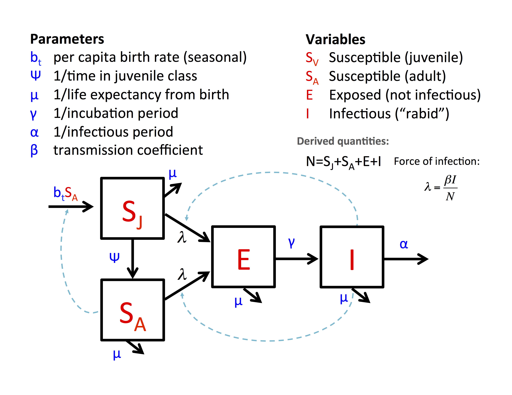

> **Research Question:** Can Eastern red fox populations maintain rabies virus transmission?

Susceptible foxes enter the population through birth, and the rate at which foxes are born varies seasonally and as a function of how many uninfected (susceptible) adult foxes are in the population at a given time. Juvenile foxes age into the adult class, on average $1/\psi$ time units after they are born. Both juveniles and adults can be infected by infectious foxes, and susceptible foxes experience a force of infection proportional to the prevalence of infectious foxes in the population. Once infected, foxes enter the exposed class. The incubation period is $1/\gamma$ time units (on average), after which the animals develop rabies, which is equivalent to transitioning from the exposed class to the infectious class. All foxes in the population experience background mortality with hazard $\mu$, and infectious foxes experience an additional disease-induced hazard of mortality, $\alpha$.

{:width="100%"}
